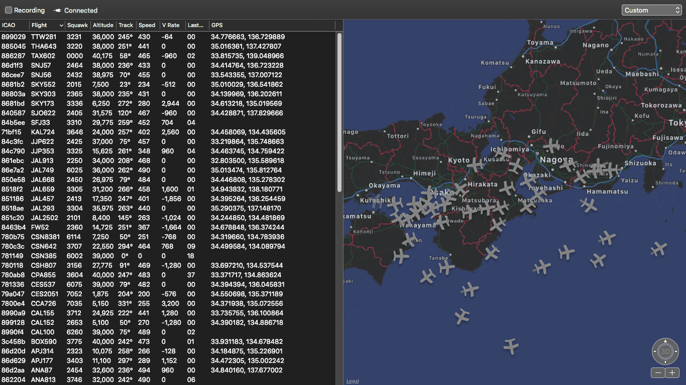

theme: Plain Jane, 2
footer: Kenji Rikitake / Kichijoji.pm 19
slidenumbers: true

# How I discover a working implementation of `clock_nanosleep()` for macOS in CPAN `Time::Hires`

---

## Kenji Rikitake

## りきたけ けんじ

## 力武 健次

2-AUG-2019
kichijoji.pm 19
Musashino Public Hall
Musashino City, Tokyo, Japan
@jj1bdx


---


# [fit] 技術士（情報工学部門）
# [fit] 力武健次技術士事務所 所長
# [fit] 情報処理安全確保支援士
# [fit] Guest Researcher at
# [fit] Pepabo R&D Institute
# [fit] ペパボ研究所 客員研究員

---

# Time+sleeping are hard

# [fit] `sleep()`, `usleep()`, `nanosleep()`
# [fit] `gettimeofday()`, `gmtime()`, `localtime()`
# [fit] Please don't mention all those NTP kludges and Erlang monotonic time implementation complexities for maintaining the monotonic increase characteristics of the internal time measurement. Thank you.

---

# Newer functions in Linux

# [fit] `clock_gettime()`
# [fit] `clock_nanosleep()`
# [fit] They are even defined in POSIX!

---

# Status on macOS Mojave 10.14.6

* `clock_gettime()`: defined since macOS Sierra 10.12 SDK
* `clock_nanosleep()`: still *undefined*
* So I need to build my own equivalent function to substitute `clock_nanosleep()`
* macOS uses `mach_absolute_time()`, `mach_wait_until()`, `mach_timebase_unfo()`, etc., defined in `<mach/mach_time.h>`

---

# Why I needed `clock_nanosleep()`?

* For dump1090, an ADS-B decoding software
* ADS-B: See FlightRadar24, FlightAware, etc.
* When dump1090 retrieves radiowave signals from a recorded file, it uses `clock_gettime()` and `clock_nanosleep()`

---



---

# I found a reference implementation of *emulated* `clock_nanosleep()` in `Time::Hires` of Perl CPAN

---

# CPAN `Time::Hires`

```perl
# High resolution alarm, sleep, gettimeofday, interval timers
# which consist of the system call and library function wrappers

use Time::HiRes qw( clock_gettime clock_getres clock_nanosleep
                    ITIMER_REAL ITIMER_VIRTUAL ITIMER_PROF
                    ITIMER_REALPROF );
 
$realtime   = clock_gettime(CLOCK_REALTIME);
$resolution = clock_getres(CLOCK_REALTIME);
 
clock_nanosleep(CLOCK_REALTIME, 1.5e9);
clock_nanosleep(CLOCK_REALTIME, time()*1e9 + 10e9, TIMER_ABSTIME);
``` 

---

# `Time::Hires` has the C code for emulating `clock_nanosleep()` for macOS! [^1]

```C
#ifdef TIME_HIRES_CLOCK_NANOSLEEP_EMULATION
static int th_clock_nanosleep(clockid_t clock_id, int flags,
			   const struct timespec *rqtp,
			   struct timespec *rmtp) {
  if (darwin_time_init()) {
    switch (clock_id) {
    case CLOCK_REALTIME:
    case CLOCK_MONOTONIC:
// Refer to the original code for the further information
```

[^1]: <https://metacpan.org/source/ATOOMIC/Time-HiRes-1.9760/HiRes.xs>

---

# Porting the `Time::Hires` code to dump1090 worked! [^2]

* Tested by `dump1090 --ifile test.bin`
* Worked the same as in Linux

[^2]: <https://github.com/jj1bdx/dump1090/commit/ba0b63ee1eab28e42c61d9005eadd036503d2bd7>

---

# Lessons learned

## *Standards change*
## Learn new system calls and library functions
## Perl CPAN has many valuable code jewels

---

# [fit] Thank you
# [fit] Questions?

<!--
Local Variables:
mode: markdown
coding: utf-8
End:
-->
